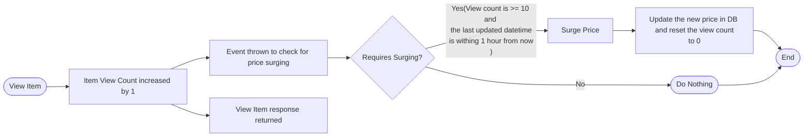

## Summary

### Price Surge Design



### API Endpoints Design
Following are the layers of the application:
1. Controllers (Endpoint)
2. Service (Business Logic)
3. DAO (Repositories)

A detailed swagger doc is available at http://localhost:8088/swagger-ui.html.

### Choice of Data Format
The data format being used for communication between client and server is Json. The reason for opting this data format is that it is easily parsable and is the most commonly used data format for REST APIs.
#### Request Example:
```shell
curl --location --request GET 'http://localhost:8088/item/view/3nkIuKDjnu' \
--header 'Cookie: JSESSIONID=A4B0117A27E2F2D8012BAA2AD8FD63EC'
```
#### Response Example:
```json
{
    "item": {
        "uid": "3nkIuKDjnu",
        "created": null,
        "lastUpdated": null,
        "itemName": "Orchid",
        "itemDescription": "Orchid",
        "itemPrice": 7.0
    }
}
```

### Authentication Mechanism
The authentication mechanism chosen is token based. A user who needs to access (to buy an item in this case), will need an access token which will be provided to them.
The token(alphabetic) is generated via apache's RandomStringUtils of 20 characters.

### Testing Structure
Integration Tests:
1. listItems
2. viewItem
3. buyItem
4. unsuccessfulAuthorization

Unit Tests:
1. surgePriceTest